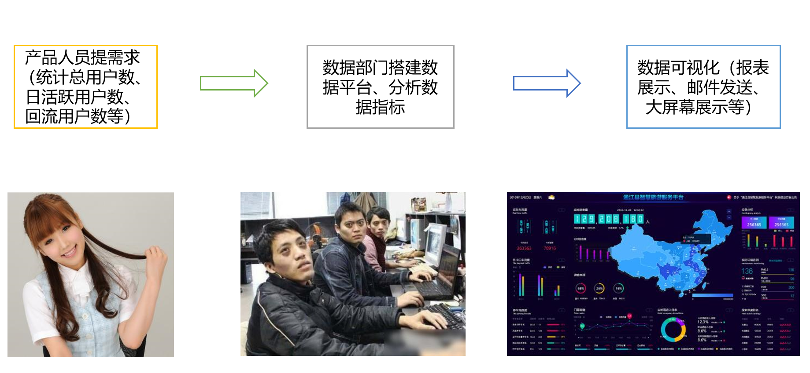
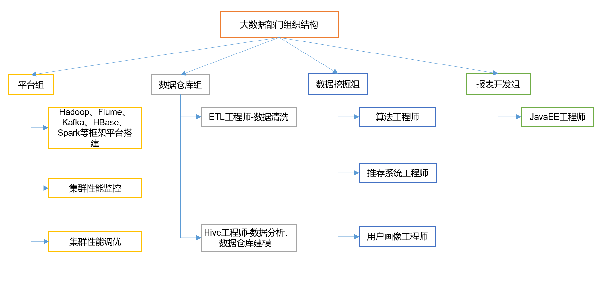
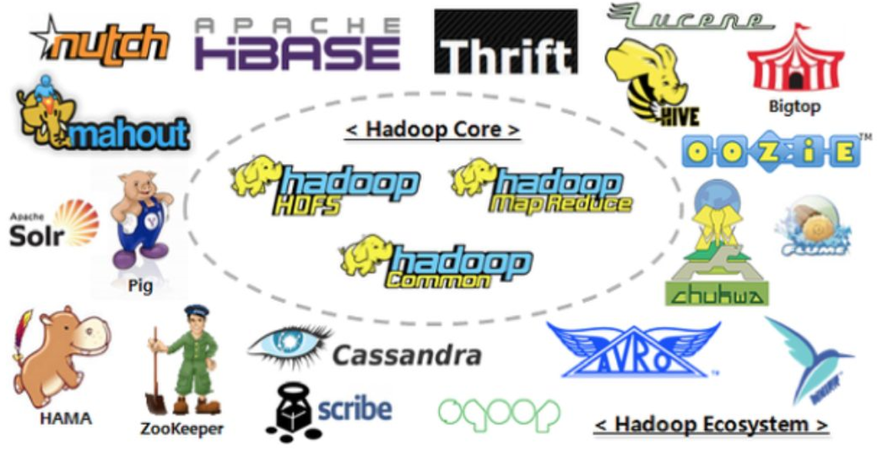
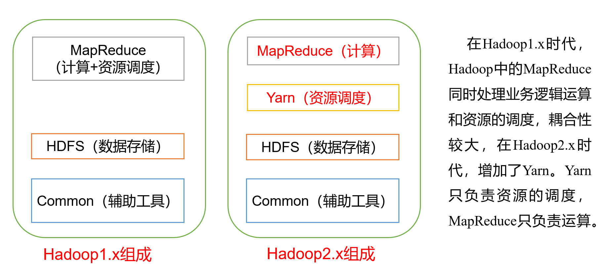
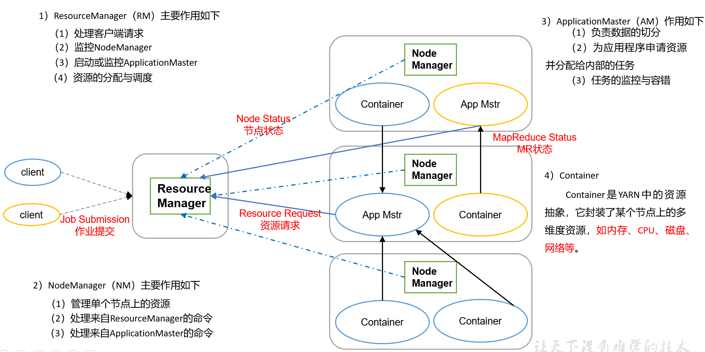
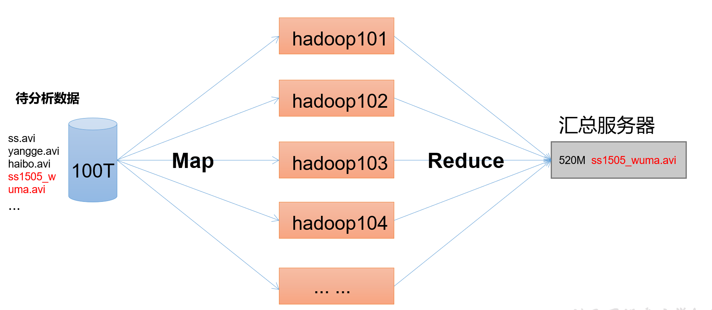
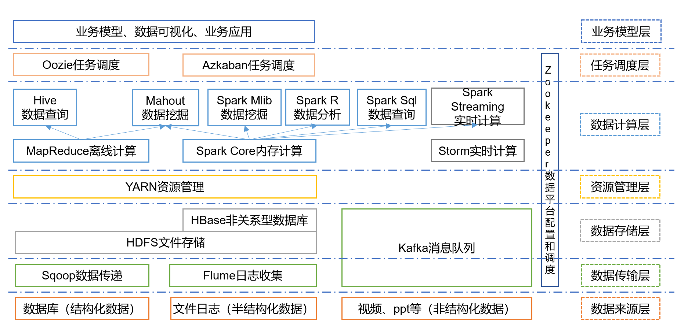
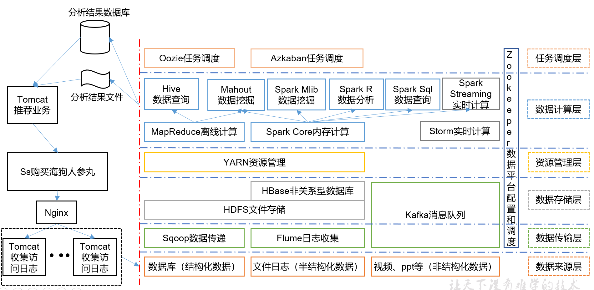

# Hadoop

## 1. 大数据概论

### 1.1 大数据概念

​    大数据（Big Data）：指无法在一定时间范围内用常规软件工具进行捕捉、管理和处理的数据集合，是需要新处理模式才能具有更强的决策力、洞察发现力和流程优化能力的海量、高增长率和多样化的信息资产。

​    主要解决，海量数据的存储和海量数据的分析计算问题。

按顺序给出数据存储单位：bit、Byte、KB、MB、GB、TB、PB、EB、ZB、YB、BB、NB、DB。

​    1Byte = 8bit 1K = 1024Byte 1MB = 1024K

​    1G = 1024M 1T = 1024G    1P = 1024T

### 1.2 大数据特点（4V）

1. **Volume**（大量）

   截至目前，人类生产的所有印刷材料的数据量是200PB，而历史上全人类总共说过的话的数据量大约是5EB。当前，典型个人计算机硬盘的容量为TB量级，而一些大企业的数据量已经接近EB量级。

2. **Velocity**（高速）

   这是大数据区分于传统数据挖掘的最显著特征。根据IDC的“数字宇宙”的报告，预计到2020年，全球数据使用量将达到35.2ZB。在如此海量的数据面前，处理数据的效率就是企业的生命。

3. **Variety**（多样）

   这种类型的多样性也让数据被分为结构化数据和非结构化数据。相对于以往便于存储的以数据库/文本为主的结构化数据，非结构化数据越来越多，包括网络日志、音频、视频、图片、地理位置信息等，这些多类型的数据对数据的处理能力提出了更高要求。

4. **Value**（低价值密度）

   价值密度的高低与数据总量的大小成反比。比如，在一天监控视频中，我们只关心宋宋老师晚上在床上健身那一分钟，如何快速对有价值数据“提纯”成为目前大数据背景下待解决的难题。

### 1.3 大数据应用场景

1. 物流仓储：大数据分析系统助力商家精细化运营、提升销量、节约成本。

2. 零售：分析用户消费习惯，为用户购买商品提供方便，从而提升商品销量。经典案例，子尿布+啤酒。

   

3. 旅游：深度结合大数据能力与旅游行业需求，共建旅游产业智慧管理、智慧服务和智慧营销的未来。

   

4. 商品广告推荐：给用户推荐可能喜欢的商品

   

5. 保险：海量数据挖掘及风险预测，助力保险行业精准营销，提升精细化定价能力。

6. 金融：多维度体现用户特征，帮助金融机构推荐优质客户，防范欺诈风险。

7. 房产：大数据全面助力房地产行业，打造精准投策与营销，选出更合适的地，建造更合适的楼，卖给更合适的人。

8. 人工智能

   

### 1.4 大数据发展前景

### 1.5 大数据部门业务流程分析



### 1.6 大数据部门组织结构（重点）




## 2. 从Hadoop框架讨论大数据生态

### 2.1 Hadoop是什么

1. Hadoop是一个由Apache基金会所开发的分布式系统基础架构。

2. 主要解决，海量数据的存储和海量数据的分析计算问题。

3. 广义上来说，Hadoop通常是指一个更广泛的概念——Hadoop生态圈。



### 2.2 Hadoop发展历史

1. Lucene框架是`Doug Cutting`开创的开源软件，用Java书写代码，实现与Google类似的全文搜索功能，它提供了全文检索引擎的架构，包括完整的查询引擎和索引引擎。

   

2. 2001年年底Lucene成为Apache基金会的一个子项目。

3. 对于海量数据的场景，Lucene面对与Google同样的困难，**存储数据困难，检索速度慢**。

4. 学习和模仿Google解决这些问题的办法 ：微型版Nutch。

5. 可以说Google是Hadoop的思想之源(Google在大数据方面的三篇论文)

6. 2003-2004年，Google公开了部分GFS和MapReduce思想的细节，以此为基础Doug Cutting等人用了**2****年业余时间**实现了DFS和MapReduce机制，使Nutch性能飙升。

7. 2005 年Hadoop 作为 Lucene的子项目 Nutch的一部分正式引入Apache基金会。

8. 2006 年 3 月份，Map-Reduce和Nutch Distributed File System (NDFS) 分别被纳入到 Hadoop 项目中，Hadoop就此正式诞生，标志着大数据时代来临。

9. 名字来源于Doug Cutting儿子的玩具大象。

   

### 2.3 Hadoop三大发行版本

Hadoop三大发行版本：Apache、Cloudera、Hortonworks。

+ Apache版本最原始（最基础）的版本，对于入门学习最好。
+ Cloudera在大型互联网企业中用的较多。
+ Hortonworks文档较好。

1. Apache Hadoop

   官网地址：http://hadoop.apache.org/releases.html

   下载地址：https://archive.apache.org/dist/hadoop/common/

2. Cloudera Hadoop

   官网地址：https://www.cloudera.com/downloads/cdh/5-10-0.html

   下载地址：http://archive-primary.cloudera.com/cdh5/cdh/5/

   1. 2008年成立的Cloudera是最早将Hadoop商用的公司，为合作伙伴提供Hadoop的商用解决方案，主要是包括支持、咨询服务、培训。
   2. **2009年Hadoop的创始人Doug Cutting也加盟Cloudera公司**。Cloudera产品主要为CDH，Cloudera Manager，Cloudera Support
   3. CDH是Cloudera的Hadoop发行版，完全开源，比Apache Hadoop在兼容性，安全性，稳定性上有所增强。
   4. Cloudera Manager是集群的软件分发及管理监控平台，可以在几个小时内部署好一个Hadoop集群，并对集群的节点及服务进行实时监控。Cloudera Support即是对Hadoop的技术支持。
   5. Cloudera的标价为每年每个节点4000美元。Cloudera开发并贡献了可实时处理大数据的Impala项目。

3. Hortonworks Hadoop

   官网地址：https://hortonworks.com/products/data-center/hdp/

   下载地址：https://hortonworks.com/downloads/#data-platform

   1. 2011年成立的Hortonworks是雅虎与硅谷风投公司Benchmark Capital合资组建。
   2. **公司成立之初就吸纳了大约25名至30名专门研究Hadoop的雅虎工程师，上述工程师均在2005年开始协助雅虎开发Hadoop，贡献了Hadoop80%的代码。**
   3. 雅虎工程副总裁、雅虎Hadoop开发团队负责人Eric Baldeschwieler出任Hortonworks的首席执行官。
   4. Hortonworks的主打产品是Hortonworks Data Platform（HDP），也同样是100%开源的产品，HDP除常见的项目外还包括了Ambari，一款开源的安装和管理系统。
   5. HCatalog，一个元数据管理系统，HCatalog现已集成到Facebook开源的Hive中。Hortonworks的Stinger开创性的极大的优化了Hive项目。Hortonworks为入门提供了一个非常好的，易于使用的沙盒。
   6. Hortonworks开发了很多增强特性并提交至核心主干，这使得Apache Hadoop能够在包括Window Server和Windows Azure在内的Microsoft Windows平台上本地运行。定价以集群为基础，每10个节点每年为12500美元。

### 2.4 Hadoop的优势（4高）

1. 高可靠性：Hadoop底层维护多个数据副本，所以即使Hadoop某个计算元素或存储出现故障，也不会导致数据的丢失。
2. 高扩展性：在集群间分配任务数据，可方便的扩展数以千计的节点。
3. 高效性：在MapReduce的思想下，Hadoop是并行工作的，以加快任务处理速度。
4. 高容错性：能够自动将失败的任务重新分配。

### 2.5 Hadoop组成（面试重点）



#### 2.5.1 HDFS架构概述


#### 2.5.2 YARN架构概述



#### 2.5.3 MapReduce架构概述

MapReduce将计算过程分为两个阶段：Map和Reduce

1. Map阶段并行处理输入数据

2. Reduce阶段对Map结果进行汇总



### 2.6 大数据技术生态体系



1. Sqoop：Sqoop是一款开源的工具，主要用于在Hadoop、Hive与传统的数据库(MySql)间进行数据的传递，可以将一个关系型数据库（例如 ：MySQL，Oracle 等）中的数据导进到Hadoop的HDFS中，也可以将HDFS的数据导进到关系型数据库中。
2. Flume：Flume是Cloudera提供的一个高可用的，高可靠的，分布式的海量日志采集、聚合和传输的系统，Flume支持在日志系统中定制各类数据发送方，用于收集数据；同时，Flume提供对数据进行简单处理，并写到各种数据接受方（可定制）的能力。
3. Kafka：Kafka是一种高吞吐量的分布式发布订阅消息系统，有如下特性：
   1. 通过O(1)的磁盘数据结构提供消息的持久化，这种结构对于即使数以TB的消息存储也能够保持长时间的稳定性能。
   2. 高吞吐量：即使是非常普通的硬件Kafka也可以支持每秒数百万的消息。
   3. 支持通过Kafka服务器和消费机集群来分区消息。
   4. 支持Hadoop并行数据加载。
4. Storm：Storm用于“连续计算”，对数据流做连续查询，在计算时就将结果以流的形式输出给用户。
5. Spark：Spark是当前最流行的开源大数据内存计算框架。可以基于Hadoop上存储的大数据进行计算。
6. Oozie：Oozie是一个管理Hdoop作业（job）的工作流程调度管理系统。
7. Hbase：HBase是一个分布式的、面向列的开源数据库。HBase不同于一般的关系数据库，它是一个适合于非结构化数据存储的数据库。
8. Hive：Hive是基于Hadoop的一个数据仓库工具，可以将结构化的数据文件映射为一张数据库表，并提供简单的SQL查询功能，可以将SQL语句转换为MapReduce任务进行运行。 其优点是学习成本低，可以通过类SQL语句快速实现简单的MapReduce统计，不必开发专门的MapReduce应用，十分适合数据仓库的统计分析。
9. R语言：R是用于统计分析、绘图的语言和操作环境。R是属于GNU系统的一个自由、免费、源代码开放的软件，它是一个用于统计计算和统计制图的优秀工具。
10. Mahout：Apache Mahout是个可扩展的机器学习和数据挖掘库。
11. ZooKeeper：Zookeeper是Google的Chubby一个开源的实现。它是一个针对大型分布式系统的可靠协调系统，提供的功能包括：配置维护、名字服务、 分布式同步、组服务等。ZooKeeper的目标就是封装好复杂易出错的关键服务，将简单易用的接口和性能高效、功能稳定的系统提供给用户。

### 2.7 推荐系统框架图




## 3. Hadoop运行环境搭建（开发重点）

### 3.1 虚拟机环境准备

1. 克隆虚拟机
2. 修改克隆虚拟机的静态IP
3. 修改主机名
4. 关闭防火墙
5. 创建 clownfish 用户
6. 配置 clownfish 用户具有root权限
7. 在/opt目录下创建文件夹
   1. 在/opt目录下创建module、software文件夹
   2. 修改module、software文件夹的所有者 chown

### 3.2 安装JDK

1. 卸载现有JDK
```shell
      # 查询是否安装Java软件：
      $ rpm -qa | grep java
      # 如果安装的版本低于1.7，卸载该JDK：
      $ sudo rpm -e 软件包
      # 查看JDK安装路径：
      $ which java
```
2. 安装JDK
```shell
      # 先获取JDK路径
      $ pwd
      # 打开/etc/profile文件
      $ sudo vi /etc/profile
      # 在profile文件末尾添加JDK路径
      #JAVA_HOME
      export JAVA_HOME=/opt/module/jdk1.8.0_144
      export PATH=$PATH:$JAVA_HOME/bin
      # 让修改后的文件生效
      $ source /etc/profile
      # 测试JDK是否安装成功
      $ java -version
```

### 3.3 安装Hadoop

 Hadoop下载地址：

https://archive.apache.org/dist/hadoop/common/hadoop-2.7.2/

```shell
# 解压安装文件到/opt/module下面
$ tar -zxvf hadoop-2.7.2.tar.gz -C /opt/module/
# 查看是否解压成功
$ ls /opt/module/
# 将Hadoop添加到环境变量
# 打开/etc/profile文件
$ sudo vi /etc/profile
##HADOOP_HOME
export HADOOP_HOME=/opt/module/hadoop-2.7.2
export PATH=$PATH:$HADOOP_HOME/bin
export PATH=$PATH:$HADOOP_HOME/sbin
# 让修改后的文件生效
$ source /etc/profile
# 测试是否安装成功
$ hadoop version
```

### 3.4 Hadoop目录结构

（1）bin目录：存放对Hadoop相关服务（HDFS,YARN）进行操作的脚本

（2）etc目录：Hadoop的配置文件目录，存放Hadoop的配置文件

（3）lib目录：存放Hadoop的本地库（对数据进行压缩解压缩功能）

（4）sbin目录：存放启动或停止Hadoop相关服务的脚本

（5）share目录：存放Hadoop的依赖jar包、文档、和官方案例


## 4. Hadoop运行模式

Hadoop运行模式包括：本地模式、伪分布式模式以及完全分布式模式。

Hadoop官方网站：http://hadoop.apache.org/

### 4.1 本地运行模式

#### 4.1.1 官方Grep案例

```shell
# 1. 创建在hadoop-2.7.2文件下面创建一个input文件夹
$ mkdir input
# 2. 将Hadoop的xml配置文件复制到input
$ cp etc/hadoop/*.xml input
# 3. 执行share目录下的MapReduce程序
$ hadoop jar share/hadoop/mapreduce/hadoop-mapreduce-examples-2.7.2.jar grep input output 'dfs[a-z.]+'
# 4. 查看输出结果
$ ll output/
$ cat output/part-r-00000
```

#### 4.1.2 官方WordCount案例

```shell
# 1. 创建在hadoop-2.7.2文件下面创建一个wcinput文件夹
$ mkdir wcinput
# 2. 在wcinput文件下创建一个wc.input文件
$ cd wcinput
$ touch wc.input
# 3. 编辑wc.input文件
$ vi wc.input
# 在文件中输入如下内容
hadoop yarn 
hadoop mapreduce
clownfish
clownfish7
# 保存退出：：wq
# 4.	回到Hadoop目录/opt/module/hadoop-2.7.2
# 5.	执行程序
$ hadoop jar share/hadoop/mapreduce/hadoop-mapreduce-examples-2.7.2.jar wordcount wcinput wcoutput
# 6.	查看结果
$ cat wcoutput/part-r-00000
clownfish	1
clownfish7	1
hadoop	2
mapreduce	1
yarn	1
```

### 4.2 伪分布式运行模式

#### 4.2.1 启动HDFS并运行MapReduce程序

1. 分析
   1. 配置集群
   2. 启动、测试集群增、删、查
   3. 执行WordCount案例
   
2. 执行步骤
    1. 配置集群
        1. 配置：hadoop-env.sh
	     Linux系统中获取JDK的安装路径 echo $JAVA_HOME
	    /opt/module/jdk1.8.0_144
	     修改JAVA_HOME 路径：
	    export JAVA_HOME=/opt/module/jdk1.8.0_144
	    2. 配置：core-site.xml
            <!-- 指定HDFS中NameNode的地址 -->
            <property>
                <name>fs.defaultFS</name>
                <value>hdfs://hadoopHost:9000</value>
            </property>

            <!-- 指定Hadoop运行时产生文件的存储目录 -->
            <property>
                <name>hadoop.tmp.dir</name>
                <value>/opt/module/hadoop-2.7.2/data/tmp</value>
            </property>
		3. 配置：hdfs-site.xml
			<!-- 指定HDFS副本的数量 -->
			<property>
    			<name>dfs.replication</name>
    			<value>1</value>
			</property>

	2. 启动集群
	
		1. 格式化NameNode（第一次启动时格式化，以后就不要总格式化）
			bin/hdfs namenode -format
		2. 启动NameNode
			sbin/hadoop-daemon.sh start namenode
		3. 启动DataNode
			sbin/hadoop-daemon.sh start datanode
	
	3. 查看集群
	
		查看是否启动成功
		$ jps
		**注意：jps是JDK中的命令，不是Linux命令。不安装JDK不能使用jps**
	
		web端查看HDFS文件系统
			http://hadoop101:50070/dfshealth.html#tab-overview
		注意：如果不能查看，看如下帖子处理
			http://www.cnblogs.com/zlslch/p/6604189.html
		查看产生的Log日志
		目录：hadoop-2.7.2/logs
	
		<font color='red'>思考：为什么不能一直格式化NameNode，格式化NameNode，要注意什么？</font>
		cat data/tmp/dfs/name/current/VERSION
		cat data/tmp/dfs/data/current/VERSION
		<font color='red'>注意：格式化NameNode，会产生新的集群id,导致NameNode和DataNode的集群id不一致，集群找不到已往数据。所以，格式NameNode时，一定要先删除data数据和log日志，然后再格式化NameNode。</font>
	
	4. 操作集群
	
		1. 在HDFS文件系统上**创建**一个input文件夹
			bin/hdfs dfs -mkdir -p /user/clownfish7/input
		2. 测试文件内容上传到文件系统上
			bin/hdfs dfs -put wcinput/wc.input /user/clownfish7/input/
		3. 查看上传的文件是否正确
			bin/hdfs dfs -ls  /user/clownfish7/input/
			bin/hdfs dfs -cat  /user/clownfish7/ input/wc.input
		4. 运行MapReduce程序
			bin/hadoop jar share/hadoop/mapreduce/hadoop-mapreduce-examples-2.7.2.jar wordcount /user/clownfish7/input/ /user/clownfish7/output
		5. 查看输出结果
			bin/hdfs dfs -cat /user/clownfish7/output/*
		6. 将测试文件内容下载到本地
			hdfs dfs -get /user/clownfish7/output/part-r-00000 ./wcoutput/
		7. 删除输出结果
			hdfs dfs -rm -r /user/clownfish7/output


#### 4.2.2 启动YARN并运行MapReduce程序

1. 分析
	1. 配置集群在YARN上运行MR
	2. 启动、测试集群增、删、查
	3. 在YARN上执行WordCount案例
2. 执行步骤
	1. 配置集群
		a. 配置yarn-env.sh
			export JAVA_HOME=/opt/module/jdk1.8.0_144
		b. 配置yarn-site.xml
			<!-- Reducer获取数据的方式 -->
			<property>
				<name>yarn.nodemanager.aux-services</name>
				<value>mapreduce_shuffle</value>
			</property>
			<!-- 指定YARN的ResourceManager的地址 -->
			<property>
				<name>yarn.resourcemanager.hostname</name>
				<value>hadoopHost</value>
			</property>
		c. 配置：mapred-env.sh
			export JAVA_HOME=/opt/module/jdk1.8.0_144
		d. 配置： (对mapred-site.xml.template重新命名为) mapred-site.xml 
			mv mapred-site.xml.template mapred-site.xml
			vi mapred-site.xml
			<!-- 指定MR运行在YARN上 -->
			<property>
				<name>mapreduce.framework.name</name>
				<value>yarn</value>
			</property>
	2. 启动集群
		a. 启动前必须保证NameNode和DataNode已经启动
		b. 启动ResourceManager
			sbin/yarn-daemon.sh start resourcemanager
		c. 启动NodeManager
			sbin/yarn-daemon.sh start nodemanager
	3. 集群操作
		a. YARN的浏览器页面查看
			http://hadoophost:8088/cluster
		b. 删除文件系统上的output文件
			bin/hdfs dfs -rm -R /user/atguigu/output
		c. 执行MapReduce程序
			bin/hadoop jar share/hadoop/mapreduce/hadoop-mapreduce-examples-2.7.2.jar wordcount /user/clownfish7/input  /user/clownfish7/output
		d. 查看运行结果
			bin/hdfs dfs -cat /user/atguigu/output/*

#### 4.2.3 配置历史服务器

为了查看程序的历史运行情况，需要配置一下历史服务器。具体配置步骤如下：

1.  配置mapred-site.xml

    1.  vi mapred-site.xml

    2.  <!-- 历史服务器端地址 -->
        <property>
            <name>mapreduce.jobhistory.address</name>
            <value>hadoopHost:10020</value>
        </property>
        <!-- 历史服务器web端地址 -->
        <property>
            <name>mapreduce.jobhistory.webapp.address</name>
            <value>hadoopHost:19888</value>
        </property>

2.  启动历史服务器

    1.  sbin/mr-jobhistory-daemon.sh start historyserver

3.  查看历史服务器是否启动

    1.  jps

4.  查看JobHistory

    1.  http://hadoophost:19888/jobhistory

#### 4.2.4 配置日志的聚集

日志聚集概念：应用运行完成以后，将程序运行日志信息上传到HDFS系统上。

日志聚集功能好处：可以方便的查看到程序运行详情，方便开发调试。

<font color='red'>注意：开启日志聚集功能，需要重新启动NodeManager 、ResourceManager和HistoryManager。</font>

开启日志聚集功能具体步骤如下：

1.  配置yarn-site.xml

    1.  <!-- 日志聚集功能使能 -->
        <property>
        <name>yarn.log-aggregation-enable</name>
        <value>true</value>
        </property>

        <!-- 日志保留时间设置7天 -->
        <property>
        <name>yarn.log-aggregation.retain-seconds</name>
        <value>604800</value>
        </property>

2.  关闭NodeManager 、ResourceManager和HistoryManager

    1.  sbin/yarn-daemon.sh stop resourcemanager
    2.  sbin/yarn-daemon.sh stop nodemanager
    3.  sbin/mr-jobhistory-daemon.sh stop historyserver

3.  启动NodeManager 、ResourceManager和HistoryManager

    1.  sbin/yarn-daemon.sh start resourcemanager
    2.  sbin/yarn-daemon.sh start nodemanager
    3.  sbin/mr-jobhistory-daemon.sh start historyserver

4.  删除HDFS上已经存在的输出文件

    1.  bin/hdfs dfs -rm -R /user/clownfish7/output

5.  执行WordCount程序

    1.  hadoop jar

         share/hadoop/mapreduce/hadoop-mapreduce-examples-2.7.2.jar wordcount /user/clownfish7/input /user/clownfish7/output

6.  查看日志

    1.  http://hadoopHost:19888/jobhistory

#### 4.2.5 配置文件说明

默认配置文件：
要获取的默认文件	文件存放在Hadoop的jar包中的位置
[core-default.xml]	hadoop-common-2.7.2.jar/ core-default.xml
[hdfs-default.xml]	hadoop-hdfs-2.7.2.jar/ hdfs-default.xml
[yarn-default.xml]	hadoop-yarn-common-2.7.2.jar/ yarn-default.xml
[mapred-default.xml]	hadoop-mapreduce-client-core-2.7.2.jar/ mapred-default.xml

自定义配置文件：
core-site.xml、hdfs-site.xml、yarn-site.xml、mapred-site.xml四个配置文件存放在$HADOOP_HOME/etc/hadoop这个路径上，用户可以根据项目需求重新进行修改配置。


### 4.3 完全分布式运行模式（开发重点）


## 5. Hadoop编译源码（面试重点）