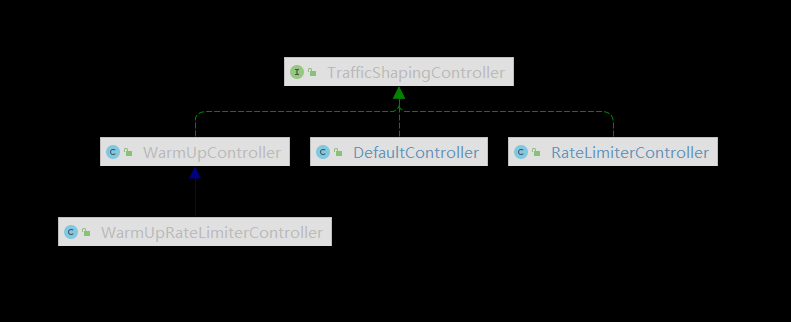

# Sentinel 限流源码分析

TrafficShapingController 是 Sentinel 流控的关键接口，分别如图有以下四种实现类

+ DefaultController
+ RateLimiterController
+ WarmUpController
+ WarmUpRateLimiterController




### DefaultController
```java
public class DefaultController implements TrafficShapingController {

    private static final int DEFAULT_AVG_USED_TOKENS = 0;

    private double count;
    private int grade;

    // ...

    @Override
    public boolean canPass(Node node, int acquireCount, boolean prioritized) {
        // 获取当前时间窗口中已经统计的数据
        int curCount = avgUsedTokens(node);
        // 根据当前时间窗口值 + 请求值 是否大于阈值判断是否放行
        if (curCount + acquireCount > count) {
            // 优先 = true 并且 QPS 限流
            if (prioritized && grade == RuleConstant.FLOW_GRADE_QPS) {
                long currentTime;
                long waitInMs;
                // 当前时间
                currentTime = TimeUtil.currentTimeMillis();
                // 等待时间
                waitInMs = node.tryOccupyNext(currentTime, acquireCount, count);
                if (waitInMs < OccupyTimeoutProperty.getOccupyTimeout()) {
                    // 添加到 borrowArray 中未来一个时间窗口上
                    node.addWaitingRequest(currentTime + waitInMs, acquireCount);
                    // 将抢占的未来的令牌也添加到原来data中的当前时间窗口里
                    node.addOccupiedPass(acquireCount);
                    sleep(waitInMs);

                    // PriorityWaitException indicates that the request will pass after waiting for {@link @waitInMs}.
                    // 开始很奇怪这里没有返回 true 抛出的异常会在 StatisticSlot 中捕获且没有再次向上抛出
                    throw new PriorityWaitException(waitInMs);
                }
            }
            return false;
        }
        return true;
    }

    private int avgUsedTokens(Node node) {
        if (node == null) {
            return DEFAULT_AVG_USED_TOKENS;
        }
        // 根据阈值类型返回 线程数 or QPS
        return grade == RuleConstant.FLOW_GRADE_THREAD ? node.curThreadNum() : (int)(node.passQps());
    }

}
```


### RateLimiterController
```java
public class RateLimiterController implements TrafficShapingController {

    // 排队最大时长，默认 500ms
    private final int maxQueueingTimeMs;
    // QPS 限制的值
    private final double count;
    // 上次请求通过的值
    private final AtomicLong latestPassedTime = new AtomicLong(-1);

    public RateLimiterController(int timeOut, double count) {
        this.maxQueueingTimeMs = timeOut;
        this.count = count;
    }

    @Override
    public boolean canPass(Node node, int acquireCount) {
        return canPass(node, acquireCount, false);
    }

    @Override   // 通常 acquireCount 为 1，这里参数 prioritized 没用到，DefaultController 会用
    public boolean canPass(Node node, int acquireCount, boolean prioritized) {
        // Pass when acquire count is less or equal than 0.
        // 请求令牌 <= 0 pass
        if (acquireCount <= 0) {
            return true;
        }
        // Reject when count is less or equal than 0.
        // Otherwise,the costTime will be max of long and waitTime will overflow in some cases.
        if (count <= 0) {
            return false;
        }

        long currentTime = TimeUtil.currentTimeMillis();
        // Calculate the interval between every two requests.
        // 计算每 2 个请求之间的间隔，比如 QPS 限制为 10，那么间隔就是 100ms
        long costTime = Math.round(1.0 * (acquireCount) / count * 1000);

        // Expected pass time of this request.
        // 上次请求通过时间 + 两个请求间隔时间
        long expectedTime = costTime + latestPassedTime.get();
        // 可以通过请求，设置了这次请求时间给最后一次通过的时间
        if (expectedTime <= currentTime) {
            // Contention may exist here, but it's okay.
            latestPassedTime.set(currentTime);
            return true;
        } else {
            // Calculate the time to wait.
            long waitTime = costTime + latestPassedTime.get() - TimeUtil.currentTimeMillis();
            if (waitTime > maxQueueingTimeMs) {
                return false;
            } else {
                // 最后一次请求时间 + 间隔时间
                long oldTime = latestPassedTime.addAndGet(costTime);
                try {
                    // 需要等待的时间
                    waitTime = oldTime - TimeUtil.currentTimeMillis();
                    if (waitTime > maxQueueingTimeMs) {
                        latestPassedTime.addAndGet(-costTime);
                        return false;
                    }
                    // in race condition waitTime may <= 0
                    if (waitTime > 0) {
                        Thread.sleep(waitTime);
                    }
                    return true;
                } catch (InterruptedException e) {
                }
            }
        }
        return false;
    }

}
```